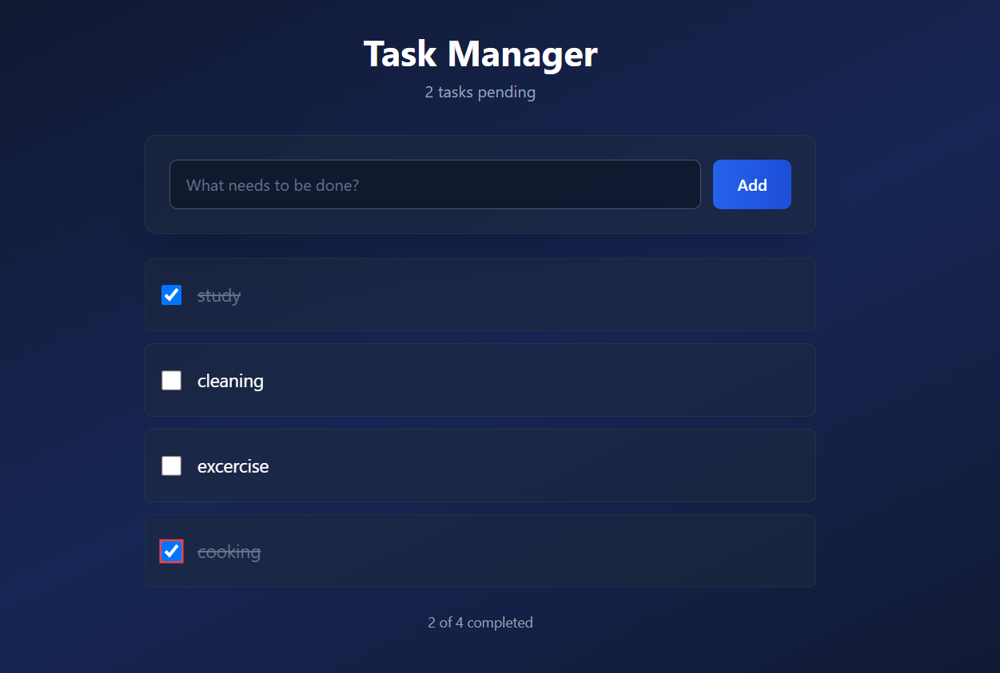

# 📝 Todo List App

A modern, responsive Todo List application built with React and styled with Tailwind CSS.

## ✨ Features

- ✅ Add, complete, and delete tasks
- 💾 Persistent storage using localStorage
- 🎨 Clean and modern UI
- 📱 Fully responsive design
- 🔍 Filter tasks (All / Active / Completed)

## 🛠️ Technologies Used

- React 18
- Tailwind CSS
- Vite
- localStorage API

## 🚀 Getting Started

### Prerequisites

- Node.js (v18 or higher)
- npm or yarn

### Installation

1. Clone the repository

```bash
git clone https://github.com/tu-usuario/todo-list-app.git
```

2. Navigate to the project directory

```bash
cd todo-list-app
```

3. Install dependencies

```bash
npm install
```

4. Start the development server

```bash
npm run dev
```

5. Open your browser and visit `http://localhost:5173`

## 📸 Screenshots



## 🌐 Live Demo

(Coming soon)

## 📝 License

This project is licensed under the MIT License.

## 👤 Author

**Renato (Harry)**

- GitHub: [@harrycrcz]-([https://github.com/harrycrcz/])
- ***

⭐ If you found this project helpful, please give it a star!
